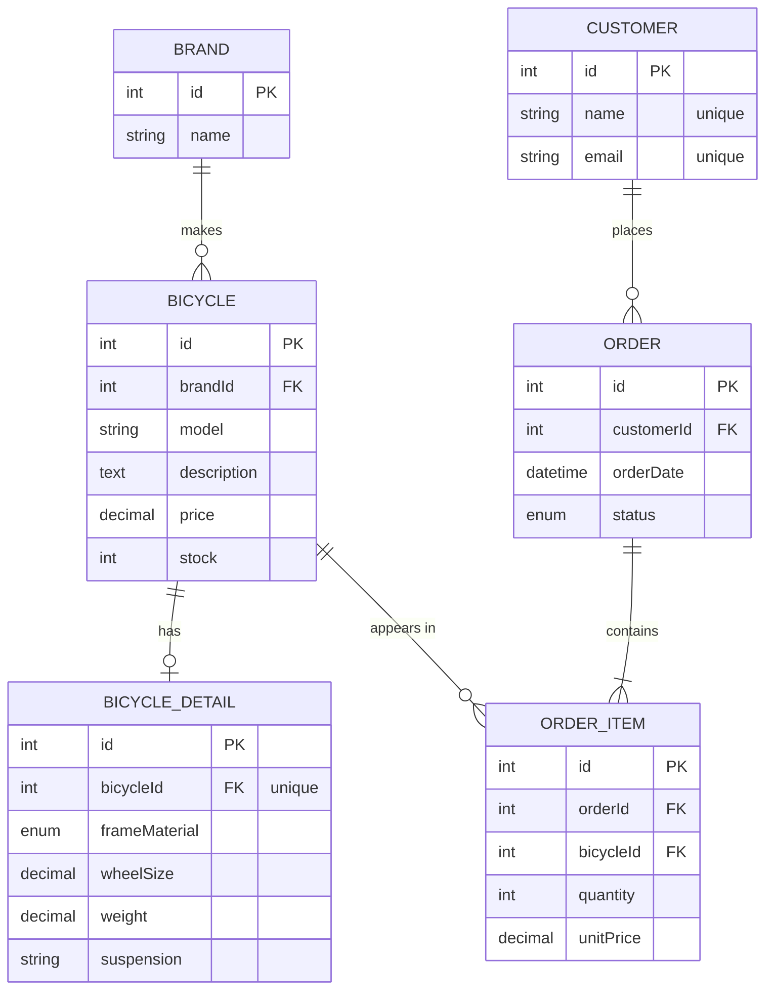

<a id="readme-top"></a>

<!-- PROJECT SHIELDS -->
[![Node.js][Node.js]][Node-url]
[![TypeScript][TypeScript]][TypeScript-url]
[![Express][Express.js]][Express-url]
[![Sequelize][Sequelize]][Sequelize-url]
[![MySQL][MySQL]][MySQL-url]
[![Postman][Postman]][Postman-url]

<!-- PROJECT LOGO -->
<br />
<div align="center">
  <h3 align="center">🚲 Bicycle Shop</h3>

  <p align="center">
    REST API for a bicycle shop: brands, bicycles, technical details, customers, orders and order lines.
    <br />
    <a href="#api-reference"><strong>Explore the endpoints »</strong></a>
    <br />
    <br />
    <a href="https://juanpablomiguelvelasquez-5850993.postman.co/workspace/4a9261fa-b085-4a63-8b11-5bd532956cf0/documentation/9F752cf9aaB7bfaefdCb44a0">Postman Workspace</a>
    &middot;
    <a href="https://github.com/jp3367/BICYCLES-SHOP/issues">Report Bug</a>
    &middot;
    <a href="https://github.com/jp3367/BICYCLES-SHOP/issues">Request Feature</a>
  </p>
</div>

<!-- TABLE OF CONTENTS -->
<details>
  <summary>Table of Contents</summary>
  <ol>
    <li>
      <a href="#about-the-project">About The Project</a>
      <ul>
        <li><a href="#built-with">Built With</a></li>
        <li><a href="#architecture">Architecture</a></li>
        <li><a href="#project-structure">Project Structure</a></li>
      </ul>
    </li>
    <li>
      <a href="#getting-started">Getting Started</a>
      <ul>
        <li><a href="#prerequisites">Prerequisites</a></li>
        <li><a href="#installation">Installation</a></li>
        <li><a href="#scripts">Scripts</a></li>
      </ul>
    </li>
    <li>
      <a href="#data-model">Data Model</a>
      <ul>
        <li><a href="#entity-relationship-diagram">Entity-Relationship Diagram</a></li>
        <li><a href="#associations">Associations</a></li>
        <li><a href="#tables">Tables</a></li>
      </ul>
    </li>
    <li><a href="#api-reference">API Reference</a></li>
    <li><a href="#eager-loading-queries">Eager Loading Queries</a></li>
    <li><a href="#quick-start-with-sample-data">Quick Start With Sample Data</a></li>
    <li><a href="#postman">Postman</a></li>
    <li><a href="#git-workflow">Git Workflow</a></li>
    <li><a href="#roadmap">Roadmap</a></li>
    <li><a href="#license">License</a></li>
    <li><a href="#contact">Contact</a></li>
    <li><a href="#acknowledgments">Acknowledgments</a></li>
  </ol>
</details>

<!-- ABOUT THE PROJECT -->
## About The Project

Bicycle Shop is a backend REST API built for the *Desarrollo Web en Entorno Servidor (DSW)* course, 2nd year of DAW at IES El Rincón.

It manages six resources and covers every type of Sequelize association:

| Resource         | Description                                         | Relationship                     |
|------------------|-----------------------------------------------------|----------------------------------|
| **Brands**       | Manufacturers the shop works with                   | Brand **1:N** Bicycle            |
| **Bicycles**     | Model, description, price and stock                 | Bicycle **1:1** BicycleDetail    |
| **Bicycle details** | Frame material, wheel size, weight, suspension   |                                  |
| **Customers**    | Name and email                                      | Customer **1:N** Order           |
| **Orders**       | Date and status of a purchase                       | Order **N:M** Bicycle            |
| **Order items**  | Lines of an order: bicycle, quantity and unit price | Junction table of the N:M        |

On top of the CRUD operations, the API includes several **eager loading queries** that use `include`, `attributes`, `as`, `where`, `required`, `Op.like` and `order`.

<p align="right">(<a href="#readme-top">back to top</a>)</p>

### Built With

* [![Node.js][Node.js]][Node-url]
* [![TypeScript][TypeScript]][TypeScript-url]
* [![Express][Express.js]][Express-url] — v5
* [![Sequelize][Sequelize]][Sequelize-url] — v6 ORM
* [![MySQL][MySQL]][MySQL-url] — through the `mysql2` driver

<p align="right">(<a href="#readme-top">back to top</a>)</p>

### Architecture

The code is organised in **modules** (one per resource), and each module is split into four layers:

```
HTTP request
    │
    ▼
 Routes ──────► Controller ──────► Service ──────► Model ──────► MySQL
 (URL → method)  (validation,       (Sequelize        (table
                  status codes)      queries)          definition)
```

| Layer          | File                      | Responsibility                                   |
|----------------|---------------------------|--------------------------------------------------|
| **Model**      | `*.model.ts`              | Table definition with Sequelize                  |
| **Service**    | `*.service.ts`            | Data access logic and queries                    |
| **Controller** | `*.controller.ts`         | Request/response handling, validation, HTTP codes |
| **Routes**     | `*.routes.ts`             | Maps URLs to controller methods                  |

All associations live in a single file, `src/models/associations.ts`, and are registered in `server.ts` before the database is synchronised.

<p align="right">(<a href="#readme-top">back to top</a>)</p>

### Project Structure

```
bicycle-shop/
├── backend/
│   ├── src/
│   │   ├── app.ts                  Express setup and base routes
│   │   ├── server.ts               Startup: associations, DB connection, sync and listen
│   │   ├── config/
│   │   │   ├── database.ts         Sequelize instance
│   │   │   └── env.ts              Environment variables
│   │   ├── models/
│   │   │   └── associations.ts     All the relationships (1:1, 1:N, N:M)
│   │   ├── routes/
│   │   │   └── index.ts            Main router (/api)
│   │   └── modules/
│   │       ├── brands/             model, service, controller, routes
│   │       ├── bicycles/           model, service, controller, routes
│   │       ├── bicycle-details/    model, service, controller, routes
│   │       ├── customers/          model, service, controller, routes
│   │       ├── orders/             model, service, controller, routes
│   │       └── order-items/        model, service, controller, routes
│   ├── .env.example
│   ├── package.json
│   └── tsconfig.json
├── frontend/                       (work in progress)
└── postman/                        Postman collection (one folder per resource)
```

<p align="right">(<a href="#readme-top">back to top</a>)</p>

<!-- GETTING STARTED -->
## Getting Started

Follow these steps to get a local copy up and running.

### Prerequisites

* Node.js 20 or later
* npm
  ```sh
  npm install npm@latest -g
  ```
* A running MySQL server (XAMPP, MAMP, Docker...)

### Installation

1. Clone the repo
   ```sh
   git clone https://github.com/jp3367/BICYCLES-SHOP.git
   ```
2. Install NPM packages
   ```sh
   cd BICYCLES-SHOP/backend
   npm install
   ```
3. Create the database in MySQL
   ```sql
   CREATE DATABASE dsw_products;
   ```
4. Copy the example environment file and fill in your values
   ```sh
   cp .env.example .env
   ```

   | Variable      | Description        | Default        |
   |---------------|--------------------|----------------|
   | `PORT`        | Server port        | `3000`         |
   | `DB_HOST`     | MySQL host         | `localhost`    |
   | `DB_PORT`     | MySQL port         | `3306`         |
   | `DB_NAME`     | Database name      | `dsw_products` |
   | `DB_USER`     | MySQL user         | `root`         |
   | `DB_PASSWORD` | MySQL password     | *(empty)*      |

5. Start the development server
   ```sh
   npm run dev
   ```
   You should see `MySQL connection established.`, `Database synchronized.` and `Server running at http://localhost:3000`.

> [!WARNING]
> In development the server runs `sequelize.sync({ force: true })`, which **drops and recreates all tables** on every start. Any data you created is lost when the server restarts.

### Scripts

| Command         | Description                               |
|-----------------|-------------------------------------------|
| `npm run dev`   | Development mode with auto-reload (`tsx`) |
| `npm run build` | Compile TypeScript into `dist/`           |
| `npm start`     | Run the compiled build (`dist/server.js`) |

<p align="right">(<a href="#readme-top">back to top</a>)</p>

<!-- DATA MODEL -->
## Data Model

### Entity-Relationship Diagram



<p align="right">(<a href="#readme-top">back to top</a>)</p>

### Associations

Defined in [`backend/src/models/associations.ts`](backend/src/models/associations.ts):

| Type    | Association                                                       | Alias (`as`)              | Notes                         |
|---------|-------------------------------------------------------------------|---------------------------|-------------------------------|
| **1:N** | `Brand.hasMany(Bicycle)` / `Bicycle.belongsTo(Brand)`             | `bicycles` / `brand`      | FK `brandId`, ON DELETE RESTRICT |
| **1:1** | `Bicycle.hasOne(BicycleDetail)` / `BicycleDetail.belongsTo(Bicycle)` | `detail` / `bicycle`   | FK `bicycleId`, ON DELETE CASCADE |
| **1:N** | `Customer.hasMany(Order)` / `Order.belongsTo(Customer)`           | `orders` / `customer`     | FK `customerId`, ON DELETE RESTRICT |
| **N:M** | `Order.belongsToMany(Bicycle, { through: OrderItem })`            | `bicycles`                | Junction table `order_items`  |
| **N:M** | `Bicycle.belongsToMany(Order, { through: OrderItem })`            | `orders`                  |                               |
| **1:N** | `Order.hasMany(OrderItem)` / `OrderItem.belongsTo(Order)`         | `items` / `order`         | FK `orderId`                  |
| **1:N** | `Bicycle.hasMany(OrderItem)` / `OrderItem.belongsTo(Bicycle)`     | `orderItems` / `bicycle`  | FK `bicycleId`                |

> [!IMPORTANT]
> The alias used in a query's `include` must match the alias of the association (`as`), otherwise Sequelize throws an error.

<p align="right">(<a href="#readme-top">back to top</a>)</p>

### Tables

All tables have `createdAt` and `updatedAt` columns managed automatically by Sequelize.

<details>
<summary><strong>Brand</strong> (<code>brands</code>)</summary>

| Field  | Type             | Required | Notes              |
|--------|------------------|----------|--------------------|
| `id`   | INTEGER UNSIGNED | -        | PK, auto increment |
| `name` | STRING(150)      | Yes      |                    |

</details>

<details>
<summary><strong>Bicycle</strong> (<code>bicycles</code>)</summary>

| Field         | Type             | Required | Notes              |
|---------------|------------------|----------|--------------------|
| `id`          | INTEGER UNSIGNED | -        | PK, auto increment |
| `brandId`     | INTEGER UNSIGNED | Yes      | FK → `brands.id` (ON UPDATE CASCADE, ON DELETE RESTRICT) |
| `model`       | STRING(150)      | No       |                    |
| `description` | TEXT             | No       |                    |
| `price`       | DECIMAL(10,2)    | Yes      |                    |
| `stock`       | INTEGER UNSIGNED | No       | Defaults to `0`    |

</details>

<details>
<summary><strong>BicycleDetail</strong> (<code>bicycle-details</code>)</summary>

| Field           | Type             | Required | Notes                                         |
|-----------------|------------------|----------|-----------------------------------------------|
| `id`            | INTEGER UNSIGNED | -        | PK, auto increment                            |
| `bicycleId`     | INTEGER UNSIGNED | Yes      | FK → `bicycles.id`, **unique** (1:1)          |
| `frameMaterial` | ENUM             | Yes      | `Aluminum`, `Steel`, `Carbon`, `Titanium`     |
| `wheelSize`     | DECIMAL(4,1)     | Yes      | In inches                                     |
| `weight`        | DECIMAL(5,2)     | Yes      | In kg                                         |
| `suspension`    | STRING(80)       | No       |                                               |

</details>

<details>
<summary><strong>Customer</strong> (<code>customers</code>)</summary>

| Field   | Type             | Required | Notes              |
|---------|------------------|----------|--------------------|
| `id`    | INTEGER UNSIGNED | -        | PK, auto increment |
| `name`  | STRING(100)      | Yes      | Unique             |
| `email` | STRING(160)      | Yes      | Unique             |

</details>

<details>
<summary><strong>Order</strong> (<code>orders</code>)</summary>

| Field        | Type             | Required | Notes                                          |
|--------------|------------------|----------|------------------------------------------------|
| `id`         | INTEGER UNSIGNED | -        | PK, auto increment                             |
| `customerId` | INTEGER UNSIGNED | Yes      | FK → `customers.id`                            |
| `orderDate`  | DATE             | No       | Defaults to now                                |
| `status`     | ENUM             | No       | `pending` (default), `paid`, `cancelled`, `shipped` |

</details>

<details>
<summary><strong>OrderItem</strong> (<code>order_items</code>)</summary>

| Field       | Type             | Required | Notes                                              |
|-------------|------------------|----------|----------------------------------------------------|
| `id`        | INTEGER UNSIGNED | -        | PK, auto increment                                 |
| `orderId`   | INTEGER UNSIGNED | Yes      | FK → `orders.id`                                   |
| `bicycleId` | INTEGER UNSIGNED | Yes      | FK → `bicycles.id`                                 |
| `quantity`  | INTEGER UNSIGNED | Yes      | Minimum `1`                                        |
| `unitPrice` | DECIMAL(10,2)    | No       | Minimum `0`. If omitted, the bicycle's current price is used |

</details>

<p align="right">(<a href="#readme-top">back to top</a>)</p>

<!-- API REFERENCE -->
## API Reference

Base URL: `http://localhost:3000`

### General

| Method | Route         | Description  |
|--------|---------------|--------------|
| GET    | `/`           | Health check |
| GET    | `/holaholita` | Test route   |

### Brands `/api/brands`

| Method | Route             | Description       | Status                               |
|--------|-------------------|-------------------|--------------------------------------|
| GET    | `/api/brands`     | List all brands   | `200`                                |
| GET    | `/api/brands/:id` | Get a brand by id | `200` / `404`                        |
| POST   | `/api/brands`     | Create a brand    | `201` / `400`                        |
| PUT    | `/api/brands/:id` | Update a brand    | `200` / `404`                        |
| DELETE | `/api/brands/:id` | Delete a brand    | `204` / `404` / `409` (has bicycles) |

```json
{ "name": "BH" }
```

### Bicycles `/api/bicycles`

| Method | Route                                              | Description                                        | Status        |
|--------|----------------------------------------------------|----------------------------------------------------|---------------|
| GET    | `/api/bicycles`                                    | List all bicycles (with their `brand`)             | `200`         |
| GET    | `/api/bicycles/:id`                                | Get a bicycle by id                                | `200` / `404` |
| GET    | `/api/bicycles/eagerly/:id`                        | Get a bicycle by id with its brand (eager loading) | `200` / `404` |
| GET    | `/api/bicycles/eagerly/frame-material/:frameMaterial` | Bicycles whose detail has that frame material   | `200`         |
| POST   | `/api/bicycles`                                    | Create a bicycle                                   | `201` / `400` |
| PUT    | `/api/bicycles/:id`                                | Update a bicycle                                   | `200` / `404` / `400` |
| DELETE | `/api/bicycles/:id`                                | Delete a bicycle (its detail is deleted too)       | `204` / `404` |

`brandId` and `price` are required on create, and `brandId` must be an existing brand:

```json
{
  "brandId": 1,
  "model": "Sky",
  "description": "Great for any occasion",
  "price": 189.99,
  "stock": 5
}
```

### Bicycle details `/api/bicycle-details`

| Method | Route                       | Description              | Status                       |
|--------|-----------------------------|--------------------------|------------------------------|
| GET    | `/api/bicycle-details`      | List all details         | `200`                        |
| GET    | `/api/bicycle-details/:id`  | Get a detail by id       | `200` / `404`                |
| POST   | `/api/bicycle-details`      | Create a detail          | `201` / `400` / `409`        |
| PUT    | `/api/bicycle-details/:id`  | Update a detail          | `200` / `404` / `400` / `409` |
| DELETE | `/api/bicycle-details/:id`  | Delete a detail          | `204` / `404`                |

`bicycleId`, `frameMaterial`, `wheelSize` and `weight` are required. A bicycle can only have **one** detail (`409` otherwise):

```json
{
  "bicycleId": 1,
  "frameMaterial": "Carbon",
  "wheelSize": 29,
  "weight": 9.8,
  "suspension": "Front"
}
```

### Customers `/api/customers`

| Method | Route                                | Description                                          | Status                             |
|--------|--------------------------------------|------------------------------------------------------|------------------------------------|
| GET    | `/api/customers`                     | List all customers                                   | `200`                              |
| GET    | `/api/customers/:id`                 | Get a customer by id                                 | `200` / `404`                      |
| GET    | `/api/customers/:name_search/orders` | Customers whose name contains the text, with orders  | `200`                              |
| POST   | `/api/customers`                     | Create a customer                                    | `201` / `400` / `409` (email taken) |
| PUT    | `/api/customers/:id`                 | Update a customer                                    | `200` / `404` / `409`              |
| DELETE | `/api/customers/:id`                 | Delete a customer                                    | `204` / `404` / `409` (has orders) |

```json
{ "name": "ibu", "email": "ibu@example.com" }
```

### Orders `/api/orders`

| Method | Route                              | Description                                   | Status                |
|--------|------------------------------------|-----------------------------------------------|-----------------------|
| GET    | `/api/orders`                      | List all orders (with their `customer`)       | `200`                 |
| GET    | `/api/orders/:id`                  | Get an order by id                            | `200` / `404`         |
| GET    | `/api/orders/customer/:customerId` | Orders of a customer, sorted by date          | `200`                 |
| POST   | `/api/orders`                      | Create an order                               | `201` / `400`         |
| PUT    | `/api/orders/:id`                  | Update an order                               | `200` / `404` / `400` |
| DELETE | `/api/orders/:id`                  | Delete an order                               | `204` / `404`         |

`customerId` is required. `status` must be `pending`, `paid`, `cancelled` or `shipped`:

```json
{ "customerId": 1, "status": "paid" }
```

### Order items `/api/order-items`

| Method | Route                                     | Description                                              | Status                |
|--------|-------------------------------------------|----------------------------------------------------------|-----------------------|
| GET    | `/api/order-items`                        | List all lines (with their `order` and `bicycle`)        | `200`                 |
| GET    | `/api/order-items/:id`                    | Get a line by id                                         | `200` / `404`         |
| GET    | `/api/order-items/order/:orderId`         | Lines of an order                                        | `200`                 |
| GET    | `/api/order-items/order/:orderId/bicycles`| An order with its bicycles (N:M query)                   | `200` / `404`         |
| GET    | `/api/order-items/summary/:status`        | Orders with that status, their lines, bicycles and total | `200` / `400`         |
| POST   | `/api/order-items`                        | Create a line                                            | `201` / `400`         |
| PUT    | `/api/order-items/:id`                    | Update a line                                            | `200` / `404` / `400` |
| DELETE | `/api/order-items/:id`                    | Delete a line                                            | `204` / `404`         |

`orderId`, `bicycleId` and `quantity` are required. If `unitPrice` is not sent, the current price of the bicycle is used:

```json
{ "orderId": 1, "bicycleId": 1, "quantity": 2 }
```

Example with `curl`:

```sh
curl -X POST http://localhost:3000/api/order-items \
  -H "Content-Type: application/json" \
  -d '{"orderId":1,"bicycleId":1,"quantity":2}'
```

<p align="right">(<a href="#readme-top">back to top</a>)</p>

<!-- EAGER LOADING QUERIES -->
## Eager Loading Queries

These are the queries that go beyond plain CRUD and load related models in a single SQL statement.

| # | Endpoint | Models | Concepts used |
|---|----------|--------|---------------|
| 1 | `GET /api/bicycles/eagerly/:id` | Bicycle → Brand | `include`, `as`, `attributes` |
| 2 | `GET /api/bicycles/eagerly/frame-material/:frameMaterial` | Bicycle → BicycleDetail | `include`, `where` inside `include` |
| 3 | `GET /api/customers/:name_search/orders` | Customer → Order | `Op.like`, `required: true` |
| 4 | `GET /api/order-items/order/:orderId/bicycles` | Order ⇄ Bicycle (through OrderItem) | `belongsToMany`, `through.attributes` |
| 5 | `GET /api/order-items/summary/:status?model=` | Order → OrderItem → Bicycle | nested `include`, `required`, `Op.like`, `order` on included model |

<details>
<summary><strong>3. Customers by name with their orders</strong></summary>

```sql
SELECT c.*, o.*
FROM customers c INNER JOIN orders o ON o.customerId = c.id
WHERE c.name LIKE '%ibu%';
```

`required: true` turns the `LEFT JOIN` into an `INNER JOIN`, so only customers that have orders are returned.

</details>

<details>
<summary><strong>4. An order with its bicycles (N:M)</strong></summary>

Jumps directly from `Order` to `Bicycle` through the junction table. The `quantity` and `unitPrice` of each line appear inside every bicycle under the `OrderItem` key.

```ts
Order.findByPk(orderId, {
    include: [{
        model: Bicycle,
        as: "bicycles",
        attributes: ["id", "model", "price"],
        through: { attributes: ["quantity", "unitPrice"] },
    }],
});
```

</details>

<details>
<summary><strong>5. Order summary by status (Order → OrderItem → Bicycle)</strong></summary>

Returns the orders with a given status, each one with its lines, the bicycle of every line and a calculated `total` (`quantity × unitPrice`). The optional `?model=` query parameter keeps only orders that contain a bicycle whose model matches the text.

```sql
SELECT o.*, oi.*, b.*
FROM orders o
INNER JOIN order_items oi ON oi.orderId = o.id
INNER JOIN bicycles b     ON b.id = oi.bicycleId
WHERE o.status = 'paid' AND b.model LIKE '%pro%'
ORDER BY o.orderDate DESC, oi.id ASC;
```

Example response:

```json
[
  {
    "id": 1,
    "customerId": 1,
    "orderDate": "2026-10-01T17:28:41.000Z",
    "status": "paid",
    "items": [
      {
        "id": 1,
        "quantity": 2,
        "unitPrice": "189.99",
        "bicycle": { "id": 1, "model": "Sky Pro", "price": "189.99" }
      }
    ],
    "total": 379.98
  }
]
```

</details>

<p align="right">(<a href="#readme-top">back to top</a>)</p>

<!-- QUICK START -->
## Quick Start With Sample Data

Because the tables are recreated on every start, create the data in this order (each step depends on the previous one):

```sh
# 1. Brand
curl -X POST http://localhost:3000/api/brands -H "Content-Type: application/json" \
  -d '{"name":"BH"}'

# 2. Bicycle
curl -X POST http://localhost:3000/api/bicycles -H "Content-Type: application/json" \
  -d '{"brandId":1,"model":"Sky Pro","price":189.99,"stock":5}'

# 3. Bicycle detail
curl -X POST http://localhost:3000/api/bicycle-details -H "Content-Type: application/json" \
  -d '{"bicycleId":1,"frameMaterial":"Carbon","wheelSize":29,"weight":9.8}'

# 4. Customer
curl -X POST http://localhost:3000/api/customers -H "Content-Type: application/json" \
  -d '{"name":"ibu","email":"ibu@example.com"}'

# 5. Order
curl -X POST http://localhost:3000/api/orders -H "Content-Type: application/json" \
  -d '{"customerId":1,"status":"paid"}'

# 6. Order item
curl -X POST http://localhost:3000/api/order-items -H "Content-Type: application/json" \
  -d '{"orderId":1,"bicycleId":1,"quantity":2}'
```

Then try the eager loading queries:

```sh
curl http://localhost:3000/api/order-items/summary/paid?model=pro
```

<p align="right">(<a href="#readme-top">back to top</a>)</p>

<!-- POSTMAN -->
## Postman

All the requests used to test the API are available in Postman:

**[Open the Bicycle Shop Postman Workspace](https://juanpablomiguelvelasquez-5850993.postman.co/workspace/4a9261fa-b085-4a63-8b11-5bd532956cf0/documentation/9F752cf9aaB7bfaefdCb44a0)**

The collection is also included in this repository under [`postman/collections/bicycle-shop/`](postman/collections/bicycle-shop/), with one folder per resource:

| Folder            | Contents                                         |
|-------------------|--------------------------------------------------|
| `Random`          | Health check and test route                      |
| `Brands`          | CRUD                                             |
| `Bicycles-1`      | CRUD and eager loading by id                     |
| `Bicycle-details` | Bicycles filtered by frame material              |
| `Customers`       | CRUD and search by name with orders              |
| `Orders`          | CRUD and orders of a customer                    |
| `Order-items`     | CRUD, order with bicycles and summary by status  |

<p align="right">(<a href="#readme-top">back to top</a>)</p>

<!-- GIT WORKFLOW -->
## Git Workflow

Each assignment is delivered in its own branch, and `develop` and `main` are kept up to date with the latest one.

| Branch      | Content                                                         |
|-------------|-----------------------------------------------------------------|
| `Entrega-1` | Base API: CRUD for bicycles and brands (Brand 1:N Bicycle), Postman collection |
| `Entrega-2` | First eager loading query: bicycle by id with its brand         |
| `Entrega-3` | Bicycle 1:1 BicycleDetail and eager loading queries             |
| `Entrega-4` | Customers and orders (Customer 1:N Order)                       |
| `Entrega-5` | Order items (Order N:M Bicycle) and custom queries              |
| `develop`   | Integration branch, up to date with the latest assignment       |
| `main`      | Stable branch, up to date with the latest assignment            |

<p align="right">(<a href="#readme-top">back to top</a>)</p>

<!-- ROADMAP -->
## Roadmap

- [x] CRUD for bicycles and brands
- [x] Postman collection
- [x] 1:N association — Brand / Bicycle
- [x] 1:1 association — Bicycle / BicycleDetail
- [x] 1:N association — Customer / Order
- [x] N:M association — Order / Bicycle through OrderItem
- [x] Eager loading queries (`include`, `attributes`, `where`, `required`, `Op.like`, `order`)
- [ ] Transactions (create an order with its lines in a single transaction)
- [ ] Error handling middleware
- [ ] Better input validation
- [ ] Frontend

See the [open issues](https://github.com/jp3367/BICYCLES-SHOP/issues) for a full list of proposed features and known issues.

<p align="right">(<a href="#readme-top">back to top</a>)</p>

<!-- LICENSE -->
## License

Distributed under the ISC License.

<p align="right">(<a href="#readme-top">back to top</a>)</p>

<!-- CONTACT -->
## Contact

Juan Pablo Miguel Velásquez - juanpablomiguelvelasquez@alumno.ieselrincon.es

Project Link: [https://github.com/jp3367/BICYCLES-SHOP](https://github.com/jp3367/BICYCLES-SHOP)

<p align="right">(<a href="#readme-top">back to top</a>)</p>

<!-- ACKNOWLEDGMENTS -->
## Acknowledgments

* [Express documentation](https://expressjs.com/)
* [Sequelize documentation](https://sequelize.org/)
* [Sequelize — Eager Loading](https://sequelize.org/docs/v6/advanced-association-concepts/eager-loading/)
* [Mermaid ER diagrams](https://mermaid.js.org/syntax/entityRelationshipDiagram.html)
* [Best-README-Template](https://github.com/othneildrew/Best-README-Template)
* [Shields.io](https://shields.io/)

<p align="right">(<a href="#readme-top">back to top</a>)</p>

<!-- MARKDOWN LINKS & IMAGES -->
[Node.js]: https://img.shields.io/badge/Node.js-339933?style=for-the-badge&logo=nodedotjs&logoColor=white
[Node-url]: https://nodejs.org/
[TypeScript]: https://img.shields.io/badge/TypeScript-3178C6?style=for-the-badge&logo=typescript&logoColor=white
[TypeScript-url]: https://www.typescriptlang.org/
[Express.js]: https://img.shields.io/badge/Express-000000?style=for-the-badge&logo=express&logoColor=white
[Express-url]: https://expressjs.com/
[Sequelize]: https://img.shields.io/badge/Sequelize-52B0E7?style=for-the-badge&logo=sequelize&logoColor=white
[Sequelize-url]: https://sequelize.org/
[MySQL]: https://img.shields.io/badge/MySQL-4479A1?style=for-the-badge&logo=mysql&logoColor=white
[MySQL-url]: https://www.mysql.com/
[Postman]: https://img.shields.io/badge/Postman-FF6C37?style=for-the-badge&logo=postman&logoColor=white
[Postman-url]: https://juanpablomiguelvelasquez-5850993.postman.co/workspace/4a9261fa-b085-4a63-8b11-5bd532956cf0/documentation/9F752cf9aaB7bfaefdCb44a0
