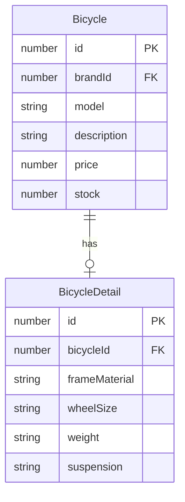
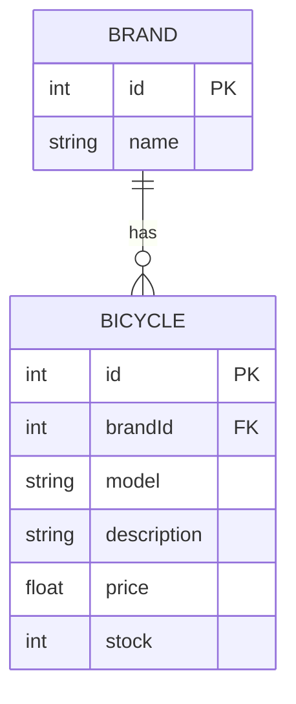
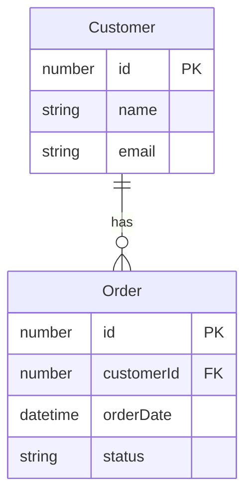

<a id="readme-top"></a>

<!-- PROJECT SHIELDS -->
[![Node.js][Node.js]][Node-url]
[![TypeScript][TypeScript]][TypeScript-url]
[![Express][Express.js]][Express-url]
[![Sequelize][Sequelize]][Sequelize-url]
[![MySQL][MySQL]][MySQL-url]
[![Postman][Postman]][Postman-url]

<!-- PROJECT LOGO -->
<br />
<div align="center">
  <h3 align="center">Bicycle Shop</h3>

  <p align="center">
    REST API for managing a bicycle shop's bicycles and brands.
    <br />
    <a href="#usage"><strong>Explore the endpoints »</strong></a>
    <br />
    <br />
    <a href="https://go.postman.co/workspace/4a9261fa-b085-4a63-8b11-5bd532956cf0">Postman Workspace</a>
    &middot;
    <a href="https://github.com/jp3367/BICYCLES-SHOP/issues">Report Bug</a>
    &middot;
    <a href="https://github.com/jp3367/BICYCLES-SHOP/issues">Request Feature</a>
  </p>
</div>

<!-- TABLE OF CONTENTS -->
<details>
  <summary>Table of Contents</summary>
  <ol>
    <li>
      <a href="#about-the-project">About The Project</a>
      <ul>
        <li><a href="#built-with">Built With</a></li>
        <li><a href="#project-structure">Project Structure</a></li>
      </ul>
    </li>
    <li>
      <a href="#getting-started">Getting Started</a>
      <ul>
        <li><a href="#prerequisites">Prerequisites</a></li>
        <li><a href="#installation">Installation</a></li>
      </ul>
    </li>
    <li><a href="#usage">Usage</a></li>
    <li><a href="#data-models">Data Models</a></li>
    <li><a href="#postman">Postman</a></li>
    <li><a href="#roadmap">Roadmap</a></li>
    <li><a href="#license">License</a></li>
    <li><a href="#contact">Contact</a></li>
    <li><a href="#acknowledgments">Acknowledgments</a></li>
  </ol>
</details>

<!-- ABOUT THE PROJECT -->
## About The Project

Bicycle Shop is a backend REST API built for the *Desarrollo Web en Entorno Servidor (DSW)* course, 2nd year of DAW at IES El Rincón.

It exposes CRUD operations for two resources:

* **Bicycles**: brand (`brandId`), model, description, price and stock.
* **Brands**: the manufacturers the shop works with.

The code is organised in modules, and each module is split into layers:

* **Model**: table definition with Sequelize.
* **Service**: data access logic.
* **Controller**: HTTP request/response handling and validation.
* **Routes**: maps URLs to controller methods.

<p align="right">(<a href="#readme-top">back to top</a>)</p>

### Built With

* [![Node.js][Node.js]][Node-url]
* [![TypeScript][TypeScript]][TypeScript-url]
* [![Express][Express.js]][Express-url]
* [![Sequelize][Sequelize]][Sequelize-url]
* [![MySQL][MySQL]][MySQL-url]

<p align="right">(<a href="#readme-top">back to top</a>)</p>

### Project Structure

```
bicycle-shop/
├── backend/
│   ├── src/
│   │   ├── app.ts              Express setup and base routes
│   │   ├── server.ts           Startup: DB connection, sync and listen
│   │   ├── config/
│   │   │   ├── database.ts     Sequelize instance
│   │   │   └── env.ts          Environment variables
│   │   ├── models/
│   │   │   └── associations.ts Brand 1:N Bicycle relationship
│   │   ├── routes/
│   │   │   └── index.ts        Main router (/api)
│   │   └── modules/
│   │       ├── bicycles/       model, service, controller, routes
│   │       └── brands/         model, service, controller, routes
│   ├── .env.example
│   ├── package.json
│   └── tsconfig.json
├── frontend/                   (work in progress)
└── postman/                    Postman collection
```

<p align="right">(<a href="#readme-top">back to top</a>)</p>

<!-- GETTING STARTED -->
## Getting Started

Follow these steps to get a local copy up and running.

### Prerequisites

* Node.js 20 or later
* npm
  ```sh
  npm install npm@latest -g
  ```
* A running MySQL server (XAMPP, MAMP, Docker...)

### Installation

1. Clone the repo
   ```sh
   git clone https://github.com/jp3367/BICYCLES-SHOP.git
   ```
2. Install NPM packages
   ```sh
   cd BICYCLES-SHOP/backend
   npm install
   ```
3. Create the database in MySQL
   ```sql
   CREATE DATABASE dsw_products;
   ```
4. Copy the example environment file and fill in your values
   ```sh
   cp .env.example .env
   ```

   | Variable      | Description        | Default        |
   |---------------|--------------------|----------------|
   | `PORT`        | Server port        | `3000`         |
   | `DB_HOST`     | MySQL host         | `localhost`    |
   | `DB_PORT`     | MySQL port         | `3306`         |
   | `DB_NAME`     | Database name      | `dsw_products` |
   | `DB_USER`     | MySQL user         | `root`         |
   | `DB_PASSWORD` | MySQL password     | *(empty)*      |

5. Start the development server
   ```sh
   npm run dev
   ```

Other scripts:

| Command         | Description                            |
|-----------------|----------------------------------------|
| `npm run dev`   | Development mode with auto-reload      |
| `npm run build` | Compile TypeScript                     |
| `npm start`     | Run the compiled build (`dist/server.js`) |

> **Note:** in development the server runs `sequelize.sync({ force: true })`, which **drops and recreates all tables** on every start.

<p align="right">(<a href="#readme-top">back to top</a>)</p>

<!-- USAGE -->
## Usage

Base URL: `http://localhost:3000`

### General

| Method | Route         | Description              |
|--------|---------------|--------------------------|
| GET    | `/`           | Health check             |
| GET    | `/holaholita` | Test route               |

### Bicycles `/api/bicycles`

| Method | Route               | Description          | Status        |
|--------|---------------------|----------------------|---------------|
| GET    | `/api/bicycles`     | List all bicycles    | `200`         |
| GET    | `/api/bicycles/:id` | Get a bicycle by id  | `200` / `404` |
| POST   | `/api/bicycles`     | Create a bicycle     | `201` / `400` |
| PUT    | `/api/bicycles/:id` | Update a bicycle     | `200` / `404` |
| DELETE | `/api/bicycles/:id` | Delete a bicycle     | `204` / `404` |

Request body (`brandId` and `price` are required on create; `brandId` must be an existing brand, otherwise `400`). Responses include the related `brand` (`id`, `name`):

```json
{
  "brandId": 1,
  "model": "Sky",
  "description": "Great for any occasion",
  "price": 189.99,
  "stock": 5
}
```

### Brands `/api/brands`

| Method | Route             | Description        | Status        |
|--------|-------------------|--------------------|---------------|
| GET    | `/api/brands`     | List all brands    | `200`         |
| GET    | `/api/brands/:id` | Get a brand by id  | `200` / `404` |
| POST   | `/api/brands`     | Create a brand     | `201` / `400` |
| PUT    | `/api/brands/:id` | Update a brand     | `200` / `404` |
| DELETE | `/api/brands/:id` | Delete a brand     | `204` / `404` / `409` (has bicycles) |

Request body (`name` is required on create):

```json
{
  "name": "BH"
}
```

Example with `curl`:

```sh
curl -X POST http://localhost:3000/api/bicycles \
  -H "Content-Type: application/json" \
  -d '{"brandId":1,"model":"Sky","price":189.99,"stock":5}'
```

<p align="right">(<a href="#readme-top">back to top</a>)</p>

<!-- DATA MODELS -->
## Data Models

A brand has many bicycles and each bicycle belongs to one brand (see `src/models/associations.ts`).

### Entity-Relationship Diagram

RELATION 1:1


RELATION 1:N

RELATION 1:N


<p align="right">(<a href="#readme-top">back to top</a>)</p>

### Bicycle (`bicycles`)

| Field         | Type             | Required | Notes              |
|---------------|------------------|----------|--------------------|
| `id`          | INTEGER UNSIGNED | -        | PK, auto increment |
| `brandId`     | INTEGER UNSIGNED | Yes      | FK → `brands.id` (ON UPDATE CASCADE, ON DELETE RESTRICT) |
| `model`       | STRING(150)      | No       |                    |
| `description` | TEXT             | No       |                    |
| `price`       | DECIMAL(10,2)    | Yes      |                    |
| `stock`       | INTEGER UNSIGNED | No       | Defaults to `0`    |
| `createdAt`   | DATE             | -        | Automatic          |
| `updatedAt`   | DATE             | -        | Automatic          |

### Brand (`brands`)

| Field       | Type             | Required | Notes              |
|-------------|------------------|----------|--------------------|
| `id`        | INTEGER UNSIGNED | -        | PK, auto increment |
| `name`      | STRING(150)      | Yes      |                    |
| `createdAt` | DATE             | -        | Automatic          |
| `updatedAt` | DATE             | -        | Automatic          |

A brand has many bicycles and each bicycle belongs to one brand (see `src/models/associations.ts`).

<p align="right">(<a href="#readme-top">back to top</a>)</p>

<!-- POSTMAN -->
## Postman

All the requests used to test the API are available in Postman:

**[Open the Bicycle Shop Postman Workspace](https://documenter.getpostman.com/view/58320230/2sBYHNWNar))**

The collection is also included in this repository under the [`postman/`](postman/) folder, split into two folders: **Bicycles** and **Brands**.

<p align="right">(<a href="#readme-top">back to top</a>)</p>

<!-- ROADMAP -->
## Roadmap

- [x] CRUD for bicycles
- [x] CRUD for brands
- [x] Postman collection
- [x] Link `Bicycle` to `Brand` through `brandId`
- [ ] Better input validation
- [ ] Error handling middleware
- [ ] Frontend

See the [open issues](https://github.com/jp3367/BICYCLES-SHOP/issues) for a full list of proposed features and known issues.

<p align="right">(<a href="#readme-top">back to top</a>)</p>

<!-- LICENSE -->
## License

Distributed under the ISC License.

<p align="right">(<a href="#readme-top">back to top</a>)</p>

<!-- CONTACT -->
## Contact

Juan Pablo Miguel Velásquez - juanpablomiguelvelasquez@alumno.ieselrincon.es

Project Link: [https://github.com/jp3367/BICYCLES-SHOP](https://github.com/jp3367/BICYCLES-SHOP)

<p align="right">(<a href="#readme-top">back to top</a>)</p>

<!-- ACKNOWLEDGMENTS -->
## Acknowledgments

* [Express documentation](https://expressjs.com/)
* [Sequelize documentation](https://sequelize.org/)
* [Best-README-Template](https://github.com/othneildrew/Best-README-Template)
* [Shields.io](https://shields.io/)

<p align="right">(<a href="#readme-top">back to top</a>)</p>

<!-- MARKDOWN LINKS & IMAGES -->
[Node.js]: https://img.shields.io/badge/Node.js-339933?style=for-the-badge&logo=nodedotjs&logoColor=white
[Node-url]: https://nodejs.org/
[TypeScript]: https://img.shields.io/badge/TypeScript-3178C6?style=for-the-badge&logo=typescript&logoColor=white
[TypeScript-url]: https://www.typescriptlang.org/
[Express.js]: https://img.shields.io/badge/Express-000000?style=for-the-badge&logo=express&logoColor=white
[Express-url]: https://expressjs.com/
[Sequelize]: https://img.shields.io/badge/Sequelize-52B0E7?style=for-the-badge&logo=sequelize&logoColor=white
[Sequelize-url]: https://sequelize.org/
[MySQL]: https://img.shields.io/badge/MySQL-4479A1?style=for-the-badge&logo=mysql&logoColor=white
[MySQL-url]: https://www.mysql.com/
[Postman]: https://img.shields.io/badge/Postman-FF6C37?style=for-the-badge&logo=postman&logoColor=white
[Postman-url]: https://go.postman.co/workspace/4a9261fa-b085-4a63-8b11-5bd532956cf0
